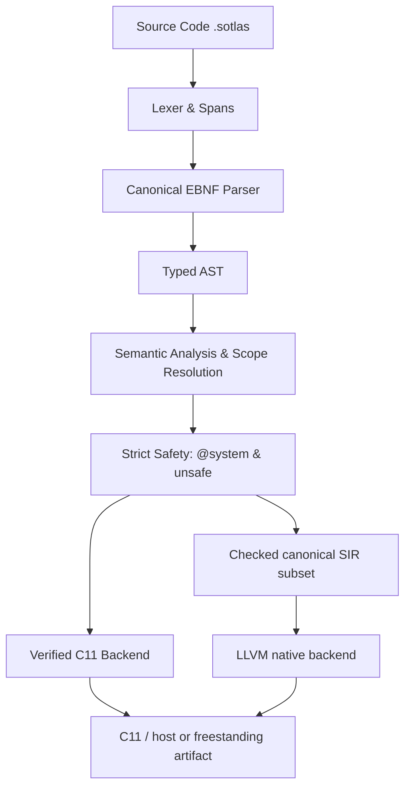

<div align="center">


# ⚡ Sotlas Programming Language

**Safe by default, unapologetically systems-capable.**  
*Engineered to eliminate the historical gaps in safety, modularity, and control left by C, C++, and Objective-C.*

[](https://github.com/HPinho/sotlas_dev/actions)
[](LICENSE)
[](#)
[](#compiler-architecture)
[](#)

[Overview](#-overview) • [Why Sotlas?](#-why-sotlas-surpassing-c-c-and-objective-c) • [Guided Tour](docs/guided_tour.md) • [Architecture](#-compiler-architecture) • [Standard Library](#-standard-library-stdlib) • [Quickstart](#-quickstart) • [Examples](examples/) • [🇧🇷 Leia em Português](README.pt-BR.md)

</div>

---

## 🌟 Overview

**Sotlas 1.0** is the first stable release of a systems programming language for low-level software. It provides a bounded, tested language contract with explicit safety boundaries, ownership checking, and native code generation. Hardware execution, general-purpose CFG lowering, and other capabilities outside that contract remain preview or planned work.

---

## 🧭 Implementation Maturity

Sotlas uses explicit maturity labels so documentation does not outrun implementation:

| Status | Meaning |
| :--- | :--- |
| **SUPPORTED** | Specification, parser, semantic verification, lowering/backend, positive tests, negative tests, and end-to-end tests are all present |
| **PREVIEW** | Useful implementation exists, but it is outside the stable 1.0 contract |
| **EXPERIMENTAL** | Some implementation exists, but the complete support contract is not yet proven |
| **PROTOTYPE** | Research/tooling implementation outside the production compilation contract |
| **DESIGNED** | Specified, but not yet implemented end-to-end |
| **PLANNED** | Roadmap item |

The installed compiler uses the canonical frontend in `compiler/sotlas_compile`. `sotlas compile --backend c11` emits C11 from that verified source pipeline. `sotlas compile --backend llvm` lowers the certified source subset through checked SIR directly to LLVM; this path rejects unsupported constructs. The default backend is LLVM when the required toolchain is available. `dump-sir` remains a prototype view, while `sir-report` inventories validated canonical SIR. The exact stable subsets and preview features are listed in the [1.0 release scope](docs/sotlas_1_0_release_scope.md) and [implementation status](docs/sotlas_implementation_status.md).

### Sotlas-specific ownership support in 1.0

The stable ownership contract covers `sole/exclusive`, `shared`, `region`, `island`, `quarantine`, `handover`, `direct`, and `whisper` in their documented subsets. `device` and `external` are **PREVIEW**. Backend coverage is not fully interchangeable: the release scope documents which backend accepts each subset, and unsupported forms are rejected.

---

## 🎯 Why Sotlas? Surpassing C, C++, and Objective-C

For decades, systems engineering and OS development were constrained by legacy languages with critical limitations:

### 1. The Shortcomings of C
* **Lack of Memory Safety**: Unrestricted raw pointer access produces chronic vulnerabilities (*buffer overflows*, *use-after-free*, *dangling pointers*).
* **Absence of Modules**: Fragile reliance on the preprocessor (`#include`), prone to global namespace collisions and macro pollution.
* **Fragile Error Handling**: Manual return of magic integers (`-1`, `NULL`), frequently ignored by developers.
* **No Privilege Distinction**: Hardware access (I/O ports, CPU registers) is indistinguishable from local memory manipulation.

### 2. The Shortcomings of C++
* **Excessive Complexity and Overhead**: Massive specifications, templates that bloat compile times and binary sizes.
* **Bare-Metal Incompatibility**: Exceptions, RTTI, and non-deterministic destructors impose an implicit runtime unsuitable for OS kernel development.
* **ABI Nightmare**: Absence of a stable, standardized ABI across different compilers and versions.

### 3. The Shortcomings of Objective-C
* **Dynamic Dispatch Overhead**: Dynamic message passing via runtime (`objc_msgSend`) imposes prohibitive latency on critical rendering loops and kernel schedulers.
* **Bug-Masking Behavior**: Messaging nil pointers (*nil-messaging*) hides serious bugs that should be caught at compile time.
* **Lack of Zero-Cost Abstractions**: Pure low-level structs and value semantics are second-class citizens compared to dynamic heap objects.

---

## 🔬 Technical Comparison Matrix

| Feature / Challenge | **Sotlas** | **C11** | **C++20** | **Objective-C** |
| :--- | :---: | :---: | :---: | :---: |
| **Safe by Default** | 🧪 Evolving / partial | ❌ No | ❌ No | ❌ No |
| **Privilege vs Memory Separation** | **`@system` vs `unsafe`** | ❌ Mixed | ❌ Mixed | ❌ Mixed |
| **Value Semantics (Zero-Cost)** | ✅ Value `struct` | ✅ Basic `struct` | ⚠️ Requires manual copies | ❌ Predominantly heap objects |
| **Reference Counting (ARC)** | 🧪 Verified ownership subset; see 1.0 support scope | ❌ Manual | ⚠️ Heavy `std::shared_ptr` | ⚠️ ARC tied to dynamic runtime |
| **Canonical Module System** | ✅ `module` & `import` | ❌ Textual `#include` | ⚠️ Complex module spec | ❌ `#include` / `#import` |
| **Contracts and Protocols** | 🧪 `spec` / `adopts` experimental | ❌ None | ⚠️ Multiple inheritance / Concepts | ⚠️ Dynamic protocols |
| **Typed Error Handling** | ✅ `Option<T>` / `Result<T, E>` | ❌ Magic integers | ⚠️ Exceptions (banned in kernels) | ⚠️ NSError / nil checks |
| **Bare-Metal / Freestanding Target** | ✅ 1st-class citizen | ✅ Native | ⚠️ Complex without runtime | ❌ Incompatible without GNUstep/Apple runtime |
| **SSA Intermediate Representation** | 🧪 Checked subset feeds reports and direct LLVM; `dump-sir` remains prototype | ❌ None | ❌ None | ❌ None |
| **Stable Bidirectional C ABI** | 🚧 Design goal; full stability contract not yet frozen | ✅ Native | ⚠️ Unstable (partial `extern "C"`) | ⚠️ Fragile outside Apple platforms |

---

## 🌐 3-Tier Interoperability Architecture (C, C++, Objective-C)

> **Formal Interoperability Goal:**
> *"Sotlas must maintain a stable, bidirectional C ABI, enabling incremental interop with C, assembly, Objective-C, and any language capable of consuming the C ABI, while isolating external memory and FFI pointers behind explicit unsafe boundaries."*

Sotlas overcomes legacy pitfalls without becoming an isolated island, establishing a strict **3-tier orthogonal separation**:

```text
                ┌──────────────────────────────────────┐
                │          Sotlas Safe Layer           │
                │ Objects / Arrays / Optionals / UI    │
                │ Guaranteed safe, zero raw pointers   │
                └──────────────────┬───────────────────┘
                                   │
                           explicit @system
                                   │
                ┌──────────────────▼───────────────────┐
                │        Sotlas Systems Layer          │
                │ Pointers / MMIO / DMA / Interrupts   │
                │ Typed hardware isolation             │
                └──────────────────┬───────────────────┘
                                   │
                              extern "C"
                                   │
            ┌──────────────────────▼──────────────────────┐
            │       C / C++ (extern "C") / Objective-C    │
            │          Assembly & Firmware                │
            │ Untrusted external memory (unsafe)          │
            └─────────────────────────────────────────────┘
```

### Boundary Pipeline:

```text
Objective-C / C / C++ ──► [Unsafe Boundary] ──► Sotlas Systems ──► [Safe Abstractions] ──► Sotlas Safe Layer
```

- **Rust-Style Guardrails**: `0xDEADBEEF as *mut u32` and dereferencing `*ptr` are rejected by the compiler outside `unsafe { ... }` blocks.
- **Explicit FFI Boundary**: Functions declared with `extern "C"` operating on raw pointers carry explicit risk and are consumed exclusively within `unsafe` blocks inside the `@system` tier.
- **Zero Kernel Overhead**: No *nil-messaging* runtime or dynamic selector lookups in kernel space; interoperability is handled through direct C ABI bridges with zero hidden cost.

---

## 🏗️ Compiler Architecture

The installed compiler starts with the canonical source frontend. It supports two explicitly scoped lowering paths: the C11 backend and a directly native LLVM backend for the checked SIR subset. The legacy `dump-sir` output is a prototype view; it is not the same contract as canonical checked SIR:



### Key Components:
- **`compiler/sotlas/frontend/`**: Canonical lexer and parser producing precise diagnostic spans.
- **`compiler/sotlas/sema/`**: Type checking, scope resolution, symbol tables, and type inference.
- **`compiler/sotlas/safety/`**: Orthogonal safety system: isolates hardware capabilities (`@system`) from raw memory operations (`unsafe { ... }`).
- **`compiler/sotlas/sir/`**: SIR instructions and the checked subset used by validated reports and direct LLVM lowering; the separate `dump-sir` view remains experimental.
- **`compiler/sotlas/codegen/`**: C11 source backend. The LLVM backend lowers its certified subset directly to native artifacts.

---

## 📦 Standard Library (`stdlib/`)

The Sotlas standard library is implemented entirely in the language itself (**Sotlas in Sotlas**) with freestanding guarantees tailored for kernels and firmware:

- **`stdlib/core/primitives.sotlas`**: Pure integer and floating-point constants and operations.
- **`stdlib/core/option.sotlas`**: Canonical `OptionU32`, `OptionI32`, and `OptionPtr` types eliminating null dereference bugs.
- **`stdlib/core/result.sotlas`**: Algebraic error types `ResultU32`, `ResultI32` with `ResultCode` status enumeration.
- **`stdlib/core/mem.sotlas`**: Freestanding low-level routines (`zero_memory`, `copy_memory`, `compare_memory`, `Buffer`).
- **`stdlib/core/arc.sotlas`**: Automatic Reference Counting primitives (`ArcHeader`, `SharedCounter`).
- **`stdlib/core/slice.sotlas`**: Safe slices with bounds checking (`ByteSlice`, `MutByteSlice`).
- **`stdlib/core/string.sotlas`**: UTF-8 string slices (`StringSlice`, `string_equals`).
- **`stdlib/core/panic.sotlas`**: Deterministic panic handler designed for operating systems.
- **`stdlib/system/intrinsics.sotlas`**: Typed hardware CPU instructions with `@system` effect (`inb`, `outb`, `cli`, `sti`, `hlt`).
- **`stdlib/runtime/`**: Freestanding C11 runtime (`runtime.h`, `runtime.c`) with zero libc dependencies.

---

## 🚀 Quickstart (verified 1.0 subset)

### 1. Installation
Clone the repository and install in editable mode:

```bash
git clone https://github.com/HPinho/sotlas_dev.git
cd sotlas_dev
pip install -e .
```

### 2. CLI Driver Commands (`sotlas`)

The compiler exposes the following commands for the supported 1.0 subset:

```bash
# Display language version
sotlas version

# Validate syntax, types, and safety without code generation
sotlas check examples/01_hello_systems/main.sotlas

# Inspect parsed AST
sotlas dump-ast examples/01_hello_systems/main.sotlas

# Inspect the prototype SIR (not the production lowering path)
sotlas dump-sir examples/01_hello_systems/main.sotlas

# Inspect validated Flow schedules, effects, and dependency provenance as JSON
sotlas flow-report path/to/module_with_flow.sotlas

# Emit auditable intermediate C11 code
sotlas compile examples/01_hello_systems/main.sotlas --emit-c

# Emit C11 from the verified example (native object/linking depends on the host toolchain)
sotlas compile examples/01_hello_systems/main.sotlas --emit-c -o hello.c

# Run test suite
sotlas test
```

---

## 💻 Experimental design example

The following class, raw-pointer, standard-library import, and `@system` syntax is
design material. It is not part of the verified 1.0 support contract. For a
program that passes the canonical frontend, use the checked-in example above.

```sotlas
module kernel::window_manager;

import core::option::*;
import core::result::*;
import system::intrinsics::*;

// Value-semantic struct with explicit field visibility
pub struct Rect {
    pub x: i32;
    pub y: i32;
    pub width: u32;
    pub height: u32;
}

// Class with Automatic Reference Counting (ARC)
pub class DesktopSurface {
    bounds: Rect;
    framebuffer: *mut u32;

    pub fn new(bounds: Rect, buffer: *mut u32) -> DesktopSurface {
        let mut surface: DesktopSurface = 0;
        surface.bounds = bounds;
        surface.framebuffer = buffer;
        return surface;
    }

    pub fn clear(self: *mut DesktopSurface, color: u32) {
        if self == null {
            return;
        }
        let total_pixels: usize = (self.bounds.width * self.bounds.height) as usize;
        let mut i: usize = 0;
        unsafe {
            while i < total_pixels {
                self.framebuffer[i] = color;
                i = i + 1;
            }
        }
    }
}

// Function with privileged operating system capability (@system)
@system
pub fn flush_screen_buffer() {
    memory_barrier();
}
```

---

## 🧪 Test Suite & Kernel Integrity Assurance

The Sotlas compiler undergoes continuous, rigorous testing to prevent regressions across the language and toolchain:

```bash
# Run all 298 unit and integration tests
python -m unittest discover -s tests -p "test_*.py"
```

Test Coverage (298 tests):
- Lexer, Spans, and Error Resilience
- Parser, AST, and Formal EBNF Grammar
- Semantic Analysis and Type Checking (3-Tier Isolation)
- Orthogonal Safety Model (`@system` and `unsafe`)
- Checked canonical SIR subset, compiler reports, and direct LLVM lowering
- C11 Lowering and Strict Code Generation
- Preliminary Textual LLVM IR Emission
- Classes, Methods, and ARC Lifetime Support
- Standard Library (`stdlib/core` and `stdlib/system`)
- Bidirectional C ABI Interoperability (`include/sotlas/sotlas_abi.h`)
- Modular compilation and freestanding target contracts

---

## 📚 Additional Documentation

- [Language Guided Tour](docs/guided_tour.md)
- [Compiler Architecture](docs/compiler_architecture.md)
- [Memory Safety & FFI](docs/safety_and_ffi.md)
- [C, C++, and Objective-C Interop](docs/interop_c_cpp_objc.md)
- [Ecosystem & Registration Roadmap](docs/ecosystem_and_registration_roadmap.md)

---

## 📄 License

Distributed under the **Apache 2.0** License. See [LICENSE](LICENSE) for details.
