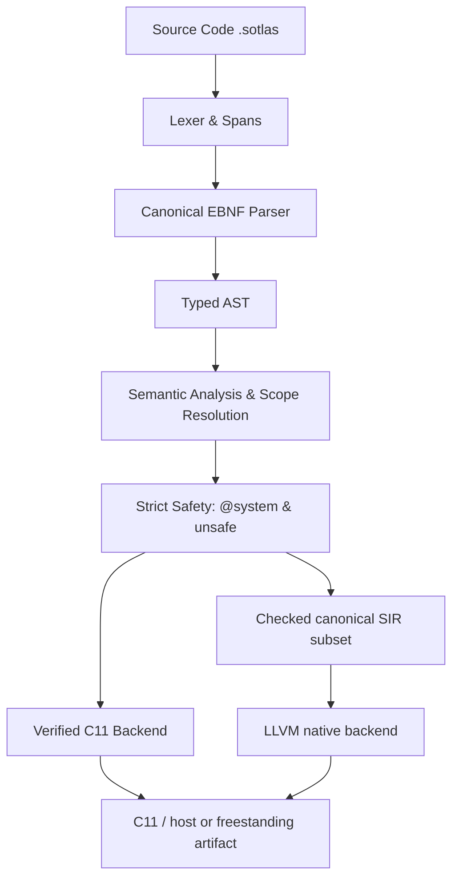

<div align="center">


# ⚡ Sotlas Programming Language

**A systems-language preview with explicit ownership and safety boundaries.**

[](https://github.com/HPinho/sotlas_dev/actions)
[](LICENSE)
[](#)
[](#compiler-architecture)
[](#)

[Overview](#-overview) • [Design Goals](#-sotlas-design-goals) • [Guided Tour](docs/guided_tour.md) • [Architecture](#-compiler-architecture) • [Standard Library](#-standard-library-stdlib) • [Quickstart](#-quickstart) • [Examples](examples/) • [🇧🇷 Leia em Português](README.pt-BR.md)

</div>

---

## 🌟 Overview

The current **Sotlas 1.0 preview candidate** is a systems-language implementation for low-level software. Its checked contract covers explicit safety boundaries, ownership analysis, and bounded native code generation. It is not a public stable release yet; hardware execution, general-purpose CFG lowering, and other capabilities outside that contract remain preview or planned work.

---

## 🧭 Implementation Maturity

Sotlas uses explicit maturity labels so documentation does not outrun implementation:

| Status | Meaning |
| :--- | :--- |
| **SUPPORTED** | Specification, parser, semantic verification, lowering/backend, positive tests, negative tests, and end-to-end tests are all present |
| **PREVIEW** | Useful implementation exists, but it is outside the stable 1.0 contract |
| **EXPERIMENTAL** | Some implementation exists, but the complete support contract is not yet proven |
| **PROTOTYPE** | Research/tooling implementation outside the production compilation contract |
| **DESIGNED** | Specified, but not yet implemented end-to-end |
| **PLANNED** | Roadmap item |

The installed compiler uses the canonical frontend in `compiler/sotlas_compile`. `sotlas compile --backend c11` emits C11 from that verified source pipeline. `sotlas compile --backend llvm` lowers the certified source subset through checked SIR directly to LLVM; this path rejects unsupported constructs. The default backend is LLVM when the required toolchain is available. `dump-sir` remains a prototype SIR view, while `sir-report` inventories validated canonical SIR. The exact supported subsets and preview features are listed in the [1.0 release scope](docs/sotlas_1_0_release_scope.md) and [implementation status](docs/sotlas_implementation_status.md).

### Sotlas-specific ownership support in 1.0

The 1.0 release scope declares bounded `SUPPORTED` subsets for `sole/exclusive`, `shared`, `region`, `island`, `quarantine`, `handover`, `direct`, and `whisper`. `device` and `external` remain **PREVIEW**. These labels apply only to the source forms and backend paths named by the release scope; they do not certify every combination or a public stable release.

---

## 🎯 Sotlas design goals

Sotlas explores explicit ownership, safety boundaries, and a small verified systems-language contract. The table below describes design tradeoffs; it is not a claim of feature parity or measured superiority.

The preview may be useful when a project benefits from explicit ownership checks,
clear `unsafe` boundaries, and a freestanding C11 output path. The compiler
currently accepts a bounded subset; the support tables below and in the release
scope describe its limits. Sotlas has not yet demonstrated broad adoption or
performance advantages over established systems languages.

---

## 🔬 Preview support at a glance

| Area | Current 1.0 preview status |
| :--- | :--- |
| Ownership and safety analysis | Verified only for the subsets listed in the [release scope](docs/sotlas_1_0_release_scope.md) |
| Native C11 output | Bounded source subset; unsupported forms are rejected |
| Flow on C11 | Serial, pure signed/unsigned integer and bool plans expose a generated C entrypoint; source callers can use a matching `@extern(C)` declaration inside `@system` code. Parallel, stateful, and ownership-bearing plans are rejected |
| LLVM output | Checked direct-lowering subset; unsupported forms are rejected |
| Hardware domains and runtime | Preview or planned; do not assume hardware execution support |
| VS Code | Syntax, outline, hover, local structural hints, compiler commands, and source-located compiler diagnostics; extension install/use smoke test runs in CI |
| Installation | Python prerelease package; clean-install smoke tests run on Linux, Windows, and macOS in CI |

These are Sotlas's current contracts, not a feature comparison with other languages. The release scope links the exact supported forms and known gaps.

For phase-by-phase test evidence and explicit boundaries, see the [generated phase gate matrix](docs/phase_gate_matrix.md), the [standard-library API contracts](stdlib/core/README.md), and the [high-level language and self-hosting roadmap](docs/high_level_and_self_hosting_roadmap.md).

---

## 🌐 Interoperability direction

The long-term design is to make C interoperability explicit and to keep unsafe
operations visible. A stable, bidirectional C ABI is a design goal; the current
preview does not promise a frozen ABI or general FFI coverage. Consult the
release scope before relying on any interop form.

```text
                ┌──────────────────────────────────────┐
                │          Sotlas Safe Layer           │
                │ Objects / Arrays / Optionals / UI    │
                │ Bounded preview safety contract     │
                └──────────────────┬───────────────────┘
                                   │
                           explicit @system
                                   │
                ┌──────────────────▼───────────────────┐
                │        Sotlas Systems Layer          │
                │ Pointers / MMIO / DMA / Interrupts   │
                │ Hardware domains in preview         │
                └──────────────────┬───────────────────┘
                                   │
                              extern "C"
                                   │
            ┌──────────────────────▼──────────────────────┐
            │       C / C++ (extern "C") / Objective-C    │
            │          Assembly & Firmware                │
            │ External memory and FFI (limited support)    │
            └─────────────────────────────────────────────┘
```

The compiler rejects unsupported FFI and pointer forms instead of implying
that they are covered by this preview. No stable ABI or zero-overhead claim is
made for the candidate.

---

## 🏗️ Compiler Architecture

The installed compiler starts with the canonical source frontend. It supports two explicitly scoped lowering paths: the C11 backend and a directly native LLVM backend for the checked SIR subset. The legacy `dump-sir` output is a prototype view; it is not the same contract as canonical checked SIR:



### Key Components:
- **`compiler/sotlas/frontend/`**: Canonical lexer and parser producing precise diagnostic spans.
- **`compiler/sotlas/sema/`**: Type checking, scope resolution, symbol tables, and type inference.
- **`compiler/sotlas/safety/`**: Orthogonal safety system: isolates hardware capabilities (`@system`) from raw memory operations (`unsafe { ... }`).
- **`compiler/sotlas/sir/`**: SIR instructions and the checked subset used by validated reports and direct LLVM lowering; the separate `dump-sir` view remains experimental.
- **`compiler/sotlas/codegen/`**: C11 source backend. The LLVM backend lowers its certified subset directly to native artifacts.

---

## 📦 Standard Library (`stdlib/`)

The `stdlib/` tree contains Sotlas modules and a separate C runtime. Its modules have different levels of test coverage; their presence does not imply a stable API, Unicode support, or suitability for a kernel or firmware target. The current native string test exercises the byte-slice and buffer operations that it can run through the C11 path:

- **`stdlib/core/primitives.sotlas`**: Pure integer and floating-point constants and operations.
- **`stdlib/core/option.sotlas`**: `OptionU32`, `OptionI32`, and `OptionPtr` representations; callers still need to check values before use.
- **`stdlib/core/result.sotlas`**: Algebraic error types `ResultU32`, `ResultI32` with `ResultCode` status enumeration.
- **`stdlib/core/mem.sotlas`**: Freestanding low-level routines (`zero_memory`, `copy_memory`, `compare_memory`, `Buffer`).
- **`stdlib/core/arc.sotlas`**: Automatic Reference Counting primitives (`ArcHeader`, `SharedCounter`).
- **`stdlib/core/slice.sotlas`**: Byte-slice helpers (`ByteSlice`, `MutByteSlice`); verify each operation's bounds and mutability contract.
- **`stdlib/core/string.sotlas`**: Byte-oriented `StringSlice` and buffer helpers. UTF-8 validation and Unicode character operations are not promised.
- **`stdlib/core/panic.sotlas`**: Panic interfaces whose behavior depends on the selected runtime.
- **`stdlib/system/intrinsics.sotlas`**: Typed hardware CPU instructions with `@system` effect (`inb`, `outb`, `cli`, `sti`, `hlt`).
- **`stdlib/runtime/`**: Freestanding C11 runtime (`runtime.h`, `runtime.c`) with zero libc dependencies.

The suite parses, type-checks, and emits selected standard-library modules. Native runtime tests execute the string fixture when GCC or Clang is available; other modules need their own end-to-end evidence before their behavior is treated as a preview contract.

---

## 🚀 Quickstart (verified preview subset)

### 1. Installation
Clone the repository and install in editable mode:

```bash
git clone https://github.com/HPinho/sotlas_dev.git
cd sotlas_dev
pip install -e .
```

### 2. Verified compiler path

Run the checked-in example through the canonical checker and C11 emitter:

```bash
# Display language version
sotlas version

# Validate syntax, types, and safety without code generation
sotlas check examples/01_hello_systems/main.sotlas

# Emit C11 from the checked-in example
sotlas compile examples/01_hello_systems/main.sotlas --backend c11 --emit-c -o hello.c
```

The CLI also has experimental inspection commands such as `dump-sir` and
backend- or feature-specific tools. Their availability does not imply that
their output is part of the stable preview contract.

The [command dispatch example](examples/07_cli_tool/README.md) is also checked
by CI through the canonical frontend and C11 backend. It demonstrates enum
dispatch; process arguments and terminal I/O remain outside this preview.

---

## 💻 Experimental design example

The following class, raw-pointer, standard-library import, and `@system` syntax is
design material. It is not part of the verified 1.0 support contract. For a
program that passes the canonical frontend, use the checked-in example above.

```sotlas
module kernel::window_manager;

import core::option::*;
import core::result::*;
import system::intrinsics::*;

// Value-semantic struct with explicit field visibility
pub struct Rect {
    pub x: i32;
    pub y: i32;
    pub width: u32;
    pub height: u32;
}

// Class with Automatic Reference Counting (ARC)
pub class DesktopSurface {
    bounds: Rect;
    framebuffer: *mut u32;

    pub fn new(bounds: Rect, buffer: *mut u32) -> DesktopSurface {
        let mut surface: DesktopSurface = 0;
        surface.bounds = bounds;
        surface.framebuffer = buffer;
        return surface;
    }

    pub fn clear(self: *mut DesktopSurface, color: u32) {
        if self == null {
            return;
        }
        let total_pixels: usize = (self.bounds.width * self.bounds.height) as usize;
        let mut i: usize = 0;
        unsafe {
            while i < total_pixels {
                self.framebuffer[i] = color;
                i = i + 1;
            }
        }
    }
}

// Function with privileged operating system capability (@system)
@system
pub fn flush_screen_buffer() {
    memory_barrier();
}
```

---

## 🧪 Test Suite & Kernel Integrity Assurance

The Sotlas compiler undergoes continuous, rigorous testing to prevent regressions across the language and toolchain:

```bash
# Run the unit and integration tests
python -m unittest discover -s tests -p "test_*.py"
```

The current suite contains more than 1,800 tests; CI reports the exact count and skipped tests for each run. It covers:
- Lexer, Spans, and Error Resilience
- Parser, AST, and Formal EBNF Grammar
- Semantic Analysis and Type Checking (3-Tier Isolation)
- Orthogonal Safety Model (`@system` and `unsafe`)
- Checked canonical SIR subset, compiler reports, and direct LLVM lowering
- C11 Lowering and Strict Code Generation
- Preliminary Textual LLVM IR Emission
- Classes, Methods, and ARC Lifetime Support
- Standard Library (`stdlib/core` and `stdlib/system`)
- Bidirectional C ABI Interoperability (`include/sotlas/sotlas_abi.h`)
- Modular compilation and freestanding target contracts

---

## 📚 Additional Documentation

- [Language Guided Tour](docs/guided_tour.md)
- [Compiler Architecture](docs/compiler_architecture.md)
- [Memory Safety & FFI](docs/safety_and_ffi.md)
- [C, C++, and Objective-C Interop](docs/interop_c_cpp_objc.md)
- [Ecosystem & Registration Roadmap](docs/ecosystem_and_registration_roadmap.md)

---

## 📄 License

Distributed under the **Apache 2.0** License. See [LICENSE](LICENSE) for details.
