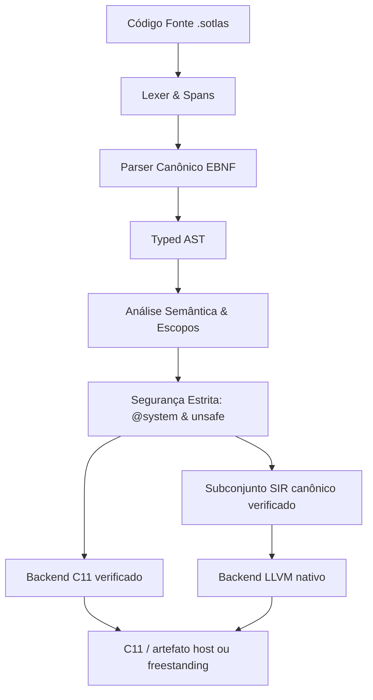

<div align="center">


# ⚡ Linguagem de Programação Sotlas

**Um preview de linguagem de sistemas com ownership e fronteiras de segurança explícitos.**

[](https://github.com/HPinho/sotlas_dev/actions)
[](LICENSE)
[](#)
[](#-arquitetura-do-compilador)
[](#)

[Visão Geral](#-visão-geral) • [Objetivos de Design](#-objetivos-de-design-da-sotlas) • [Tour Guiado](docs/guided_tour.md) • [Arquitetura](#-arquitetura-do-compilador) • [Biblioteca Padrão](#-biblioteca-padrão-stdlib) • [Quickstart](#-quickstart) • [Exemplos](examples/)

</div>

---

## 🌟 Visão Geral

O **candidato atual ao preview do Sotlas 1.0** é uma implementação de linguagem de sistemas para software de baixo nível. O contrato verificado cobre fronteiras explícitas de segurança, análise de ownership e geração nativa delimitada. Ainda não é uma versão estável publicada; execução em hardware, lowering de CFG geral e outros recursos fora desse contrato continuam em prévia ou planejados.

---

## 🧭 Maturidade de Implementação

Sotlas usa rótulos explícitos de maturidade para que a documentação não fique à frente da implementação:

| Status | Significado |
| :--- | :--- |
| **SUPPORTED** | Especificação, parser, verificação semântica, lowering/backend, testes positivos, negativos e end-to-end estão presentes |
| **PREVIEW** | Existe implementação útil, mas fora do contrato estável 1.0 |
| **EXPERIMENTAL** | Existe implementação, mas o contrato completo de suporte ainda não foi comprovado |
| **PROTOTYPE** | Implementação de pesquisa/tooling fora do contrato de compilação de produção |
| **DESIGNED** | Especificado, porém ainda não implementado de ponta a ponta |
| **PLANNED** | Item de roadmap |

O compilador instalado usa o frontend canônico em `compiler/sotlas_compile`. `sotlas compile --backend c11` emite C11 a partir desse pipeline verificado. `sotlas compile --backend llvm` baixa o subconjunto fonte certificado por SIR verificado diretamente para LLVM; construções não suportadas são rejeitadas. LLVM é o backend padrão quando a toolchain necessária está disponível. `dump-sir` continua sendo uma visualização do SIR protótipo, enquanto `sir-report` inventaria o SIR canônico validado. Os subconjuntos estáveis e recursos em prévia estão listados no [escopo de release 1.0](docs/sotlas_1_0_release_scope.md) e no [status de implementação](docs/sotlas_implementation_status.md).

### Suporte a ownership próprio da Sotlas na versão 1.0

O contrato estável de ownership cobre `sole/exclusive`, `shared`, `region`, `island`, `quarantine`, `handover`, `direct` e `whisper` nos subconjuntos documentados. `device` e `external` estão em **PREVIEW**. A cobertura dos backends não é totalmente intercambiável: o escopo do release informa qual backend aceita cada subconjunto, e formas não suportadas são rejeitadas.

---

## 🎯 Objetivos de design da Sotlas

Sotlas explora ownership explícito, fronteiras de segurança e um contrato reduzido e verificado para programação de sistemas. A tabela resume objetivos de design; ela não afirma paridade de recursos nem superioridade medida.

## 🔬 Suporte do preview em resumo

| Área | Status atual do preview 1.0 |
| :--- | :--- |
| Análise de ownership e segurança | Verificada apenas nos subconjuntos listados no [escopo do release](docs/sotlas_1_0_release_scope.md) |
| Emissão nativa C11 | Subconjunto delimitado; formas não suportadas são rejeitadas |
| Emissão LLVM | Subconjunto de lowering direto verificado; formas não suportadas são rejeitadas |
| Domínios de hardware e runtime | Em preview ou planejados; não presuma suporte de execução em hardware |
| VS Code | Sintaxe, outline, hover, dicas estruturais e comandos que chamam o compilador instalado |
| Instalação | Pacote Python prerelease; CI testa instalação limpa em Linux, Windows e macOS |

Esta tabela descreve os contratos atuais da Sotlas. O escopo do release lista formas suportadas e lacunas conhecidas.

---

## 🌐 Direção de interoperabilidade

O objetivo de longo prazo é tornar a interoperabilidade com C explícita e
manter operações inseguras visíveis. Uma ABI C estável e bidirecional é um
objetivo de design; o preview atual não promete ABI congelada nem cobertura
geral de FFI. Consulte o escopo do release antes de depender de uma forma de
interoperabilidade.

```text
                ┌──────────────────────────────────────┐
                │          Sotlas Safe Layer           │
                │ Objects / Arrays / Optionals / UI    │
                │ Contrato de segurança limitado ao preview│
                └──────────────────┬───────────────────┘
                                   │
                           explicit @system
                                   │
                ┌──────────────────▼───────────────────┐
                │        Sotlas Systems Layer          │
                │ Pointers / MMIO / DMA / Interrupts   │
                │ Domínios de hardware em preview      │
                └──────────────────┬───────────────────┘
                                   │
                              extern "C"
                                   │
            ┌──────────────────────▼──────────────────────┐
            │       C / C++ (extern "C") / Objective-C    │
            │          Assembly & Firmware                │
            │ Memória externa e FFI (suporte limitado)    │
            └─────────────────────────────────────────────┘
```

O compilador rejeita formas de FFI e ponteiros não suportadas em vez de insinuar que estão cobertas pelo preview. O candidato não promete ABI estável nem custo zero para interoperabilidade.

---

## 🏗️ Arquitetura do Compilador

O compilador instalado começa pelo frontend canônico. Há dois caminhos de lowering com escopos explícitos: o backend C11 e o backend LLVM nativo direto para o subconjunto SIR verificado. A saída legada de `dump-sir` é uma visualização protótipo; ela não representa o mesmo contrato do SIR canônico verificado:



### Principais Componentes:
- **`compiler/sotlas/frontend/`**: Analisador léxico e sintático canônico com geração de spans precisos de erro.
- **`compiler/sotlas/sema/`**: Verificação de tipos, checagem de escopos, resolução de nomes e inferência de tipos.
- **`compiler/sotlas/safety/`**: Sistema ortogonal de segurança: isola capacidades de hardware (`@system`) de blocos de manipulação de memória crua (`unsafe { ... }`).
- **`compiler/sotlas/sir/`**: instruções SIR e subconjunto verificado usado por relatórios validados e lowering LLVM direto; a visualização separada `dump-sir` permanece experimental.
- **`compiler/sotlas/codegen/`**: backend fonte C11. O backend LLVM baixa seu subconjunto certificado diretamente para artefatos nativos.

---

## 📦 Biblioteca Padrão (`stdlib/`)

A biblioteca padrão de Sotlas é implementada inteiramente na própria linguagem (**Sotlas in Sotlas**) com contratos freestanding adequados para kernels e firmware:

- **`stdlib/core/primitives.sotlas`**: Constantes e operações puras de tipos inteiros e ponto flutuante.
- **`stdlib/core/option.sotlas`**: Tipos canônicos `OptionU32`, `OptionI32` e `OptionPtr` eliminando bugs de desreferenciamento nulo.
- **`stdlib/core/result.sotlas`**: Tipos algébricos de erro `ResultU32`, `ResultI32` com enumeração de status `ResultCode`.
- **`stdlib/core/mem.sotlas`**: Rotinas de baixo nível freestanding (`zero_memory`, `copy_memory`, `compare_memory`, `Buffer`).
- **`stdlib/core/arc.sotlas`**: Primitivas de Automatic Reference Counting (`ArcHeader`, `SharedCounter`).
- **`stdlib/core/slice.sotlas`**: Fatias seguras com bounds checking (`ByteSlice`, `MutByteSlice`).
- **`stdlib/core/string.sotlas`**: Fatias de string UTF-8 (`StringSlice`, `string_equals`).
- **`stdlib/core/panic.sotlas`**: Manipulador de parada determinística para sistemas operacionais.
- **`stdlib/system/intrinsics.sotlas`**: Encapsulamento tipado de instruções de CPU de hardware com efeito `@system` (`inb`, `outb`, `cli`, `sti`, `hlt`).
- **`stdlib/runtime/`**: Runtime C11 freestanding (`runtime.h`, `runtime.c`) com zero dependências de libc.

---

## 🚀 Quickstart (subconjunto verificado do preview)

### 1. Instalação
Clone o repositório e configure em modo editável:

```bash
git clone https://github.com/HPinho/sotlas_dev.git
cd sotlas_dev
pip install -e .
```

### 2. Caminho verificado do compilador

Execute o exemplo incluído pelo verificador canônico e pelo emissor C11:

```bash
sotlas version
sotlas check examples/01_hello_systems/main.sotlas
sotlas compile examples/01_hello_systems/main.sotlas --backend c11 --emit-c -o hello.c
```

O CLI também oferece comandos experimentais de inspeção, como dump-sir, e ferramentas específicas de backend ou recurso. A existência desses comandos não significa que sua saída pertença ao contrato do preview.

O [exemplo de despacho de comandos](examples/07_cli_tool/README.md) também é
verificado pelo CI no frontend canônico e no backend C11. Ele demonstra
despacho por enum; argumentos do processo e I/O de terminal ainda não fazem
parte deste preview.

---

## 💻 Exemplo de design experimental

A sintaxe de classe, ponteiro cru, imports da biblioteca padrão e `@system` abaixo
é material de design. Ela não faz parte do contrato 1.0 verificado. Para um
programa aceito pelo frontend canônico, use o exemplo validado acima.

```sotlas
module kernel::window_manager;

import core::option::*;
import core::result::*;
import system::intrinsics::*;

// Struct com semântica de valor e visibilidade explícita de campos
pub struct Rect {
    pub x: i32;
    pub y: i32;
    pub width: u32;
    pub height: u32;
}

// Classe com gerenciamento automático de referências (ARC)
pub class DesktopSurface {
    bounds: Rect;
    framebuffer: *mut u32;

    pub fn new(bounds: Rect, buffer: *mut u32) -> DesktopSurface {
        let mut surface: DesktopSurface = 0;
        surface.bounds = bounds;
        surface.framebuffer = buffer;
        return surface;
    }

    pub fn clear(self: *mut DesktopSurface, color: u32) {
        if self == null {
            return;
        }
        let total_pixels: usize = (self.bounds.width * self.bounds.height) as usize;
        let mut i: usize = 0;
        unsafe {
            while i < total_pixels {
                self.framebuffer[i] = color;
                i = i + 1;
            }
        }
    }
}

// Função com capacidade privilegiada de sistema operacional (@system)
@system
pub fn flush_screen_buffer() {
    memory_barrier();
}
```

---

## 🧪 Suíte de Testes e Garantia de Integridade do Kernel

O compilador Sotlas é submetido a uma suíte contínua de testes para prevenir regressões na linguagem e no toolchain:

```bash
# Executar os testes unitários e de integração
python -m unittest discover -s tests -p "test_*.py"
```

A suíte atual contém mais de 1.800 testes; o CI informa a contagem exata e os testes ignorados em cada execução. A cobertura inclui:
- Lexer, Spans e Resiliência
- Parser, AST e Gramática Formal EBNF
- Análise Semântica e Checagem de Tipos (3 Camadas de Isolamento)
- Modelo Ortogonal de Segurança (`@system` e `unsafe`)
- Subconjunto SIR canônico verificado, relatórios e lowering LLVM direto
- Lowering C11 e Geração de Código Estrito
- Emissão de LLVM IR textual preliminar
- Suporte a Classes, Métodos e ARC
- Biblioteca Padrão (`stdlib/core` e `stdlib/system`)
- Interoperabilidade Bidirecional em C ABI (`include/sotlas/sotlas_abi.h`)
- Compilação modular e contratos para alvos freestanding

---

## 📚 Documentação Adicional

- [Guia da Linguagem (Guided Tour)](docs/guided_tour.md)
- [Arquitetura do Compilador](docs/compiler_architecture.md)
- [Segurança de Memória e FFI](docs/safety_and_ffi.md)
- [Interoperabilidade C, C++ e Objective-C](docs/interop_c_cpp_objc.md)
- [Análise de Ecossistema e Roteiro de Registro](docs/ecosystem_and_registration_roadmap.md)

---

## 📄 Licença

Distribuído sob a licença **Apache 2.0**. Consulte [LICENSE](LICENSE) para mais informações.
