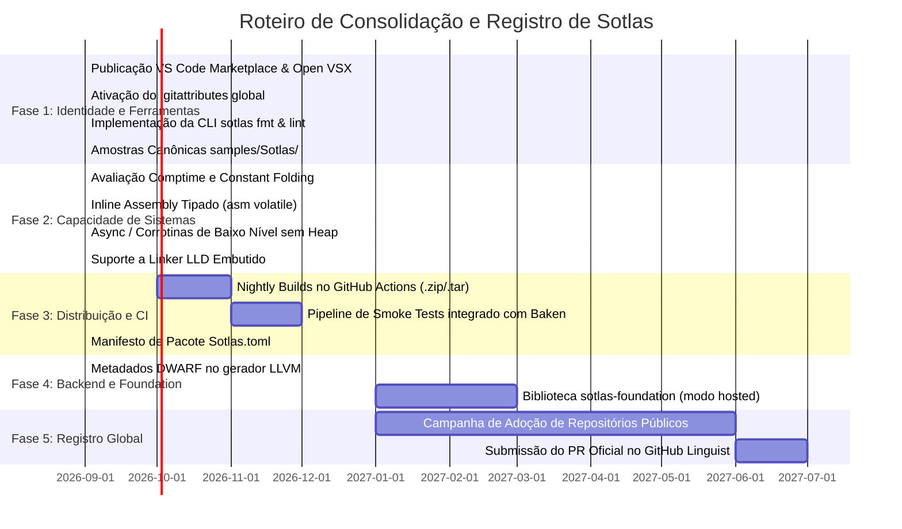

# Sotlas: Análise de Maturidade do Ecossistema e Guia de Registro Oficial
## Comparativo Arquitetural com o Ecossistema Swift e Roteiro de Industrialização

Este documento apresenta uma análise técnica completa, detalhada e comparativa entre o ecossistema de referência moderna de compiladores (ilustrado pelos repositórios do ecossistema Swift) e o estado atual da **Linguagem de Programação Sotlas**. Adicionalmente, este guia estabelece o roteiro normativo de como registrar oficialmente a linguagem perante a comunidade de software internacional (GitHub Linguist, VS Code Marketplace, Open VSX, IANA, DWARF e registros de pacotes).

---

## 1. Matriz Executiva de Comparação dos 7 Pilares

| Pilar | Ecossistema Swift (Referência) | Estado Atual de Sotlas | O Que Falta para Maturidade Industrial |
| :--- | :--- | :--- | :--- |
| **1. Compilador & Runtime** | [`swiftlang/swift`](https://github.com/swiftlang/swift)<br>• Frontend nativo C++/Swift<br>• SIL (SSA IR de alto nível)<br>• Runtime C++ determinístico<br>• Driver multi-alvo | `compiler/sotlas/` & `tools/`<br>• Frontend Python/Bootstrap<br>• SIR (SSA com passes de safety)<br>• C11 backend freestanding<br>• LLVM IR textual preliminar | • Compilador auto-hospedado (*self-hosting* em Sotlas puro)<br>• Backend nativo embutido sem dependência de Python ou GCC externo<br>• Runtime estático modular |
| **2. Biblioteca Base / Foundation** | [`swiftlang/swift-foundation`](https://github.com/swiftlang/swift-foundation)<br>• Camada hosted independente de SO<br>• JSON, Dates, Files, Networking<br>• Zero dependência de Obj-C | `stdlib/core/` & `stdlib/system/`<br>• Freestanding/Bare-metal puro<br>• Primitives, Option, Result, Slices<br>• ARC Header, Memory, Panic, I/O | • Repositório/módulo `sotlas-foundation` para modo Hosted (alocador heap, `Vec<T>`, `HashMap<K,V>`, arquivos, sockets, threads) |
| **3. CI & Build Farm** | [`ci.swift.org`](https://ci.swift.org/)<br>• Farm distribuído multi-SO<br>• Snapshots noturnos automáticos<br>• Testes de regressão de ABI | `.github/workflows/ci.yml`<br>• Testes unitários no GitHub Actions<br>• Matriz de SO (Linux, Win, Mac)<br>• 298 testes unitários passando | • Builds noturnos (*nightly snapshots*) com binários autocontidos<br>• Testes de compilação cruzada para bare-metal e kernel BakenOS no CI |
| **4. Backend LLVM & Debugging** | [`swiftlang/llvm-project`](https://github.com/swiftlang/llvm-project)<br>• Fork com SwiftCallingConv<br>• Clang Importer nativo<br>• Integração LLDB para inspeção | `compiler/sotlas/codegen_llvm.py`<br>• Emissão de LLVM IR textual<br>• Target `x86_64-unknown-none-elf`<br>• C ABI bridge bidirecional | • Metadados DWARF (`!DILocation`, `!DISubprogram`) para debugging linha a linha<br>• Suporte a `lld` (linker) embutido no driver |
| **5. Gerenciador de Pacotes** | [`swift-package-manager`](https://github.com/swiftlang/swift-package-manager)<br>• `Package.swift` declarativo<br>• Resolução SemVer descentralizada<br>• Múltiplos alvos e C-interop | `toolchain/sotlas.lock.json`<br>• Resolvedor modular em Python<br>• Resolução local para kernel | • CLI de pacotes (`sotlas pkg` / `sotlas new`)<br>• Manifesto declarativo (`Sotlas.toml`)<br>• Cache global de dependências (`~/.sotlas/`) |
| **6. Integração com IDEs** | [`swiftlang/vscode-swift`](https://github.com/swiftlang/vscode-swift)<br>• Extensão TS conectada ao LSP<br>• Depurador gráfico integrado<br>• Runner de testes na IDE | `editors/vscode/`<br>• Gramática TextMate completa<br>• Ícones de arquivos e temas<br>• Servidor LSP (`compiler/sotlas_compile/lsp.py`) | • Cliente TypeScript de ativação da extensão<br>• Integração direta de depuração (GDB/CodeLLDB)<br>• Publicação no VS Marketplace e Open VSX |
| **7. Sintaxe, Macros & Linter** | [`swiftlang/swift-syntax`](https://github.com/swiftlang/swift-syntax)<br>• Manipulação de AST com trivia<br>• Macros sintáticas seguras<br>• `swift-format` e linter | `compiler/sotlas/parser.py`<br>• AST com nós estruturados<br>• Pratt parser com precedência<br>• Diagnósticos com caret `^~~~` | • Formatador oficial de código (`sotlas fmt`)<br>• Linter de segurança de sistemas (`sotlas lint`)<br>• Preservação de trivia (comentários/espaços) para refatoração e docgen |

---

## 2. Raio-X Detalhado dos Componentes

### 2.1. O Compilador Central e Runtime (`swiftlang/swift` vs `LangSotlas`)
- **No Swift:** O compilador é um ecossistema nativo gigante. O frontend lê arquivos de código-fonte, gera AST, traduz para SIL (Swift Intermediate Language — uma representação SSA que realiza desvirtualização, otimizações de ARC determinístico e verificação de fluxo de memória), e em seguida baixa para LLVM IR para gerar binários nativos. Possui um runtime embutido (`libswiftCore`) que gerencia boxing de erros, tabelas de vtables e reflexão mínima.
- **Em Sotlas Hoje:**
  - O compilador possui um **Frontend Rico** unificado com Pratt Parser, gerador de AST e analisador semântico de três camadas (Camada Segura, Camada `@system` e Camada Externa `extern "C"` com fronteiras estritas de `unsafe`).
  - Possui o **SIR (Sotlas Intermediate Representation)** em SSA com passes de inicialização definida, checagem ortogonal de capacidades e eliminação de código inalcançável.
  - O backend principal emite **C11 freestanding padronizado** com `__auto_type` e inicializadores estáticos de vtable, além de um gerador preliminar de **LLVM IR textual**.
- **O Que Falta:**
  1. **Self-Hosting (Sotlas compilando Sotlas):** O compilador atual roda em Python 3.10+. Para atingir o nível industrial de Swift ou Rust, o compilador deve ser reescrito na própria linguagem Sotlas (ou em C/Rust durante uma fase intermediária), gerando um binário nativo executável (`sotlas.exe` / `sotlas`) sem necessidade de interpretador Python na máquina do usuário.
  2. **Linker Integrado:** Ter um backend de geração direta de objetos ELF/PE (`.o`/`.obj`) e invocar um linker integrado (como o `lld` do LLVM), eliminando a necessidade de o desenvolvedor ter o GCC ou Clang instalado externamente.

---

### 2.2. A Biblioteca Base / Foundation (`swiftlang/swift-foundation` vs `stdlib`)
- **No Swift:** A standard library básica (`swift/stdlib`) cuida apenas de arrays, strings e ponteiros. Já o `swift-foundation` é um projeto separado em Swift puro que oferece todas as abstrações de sistemas operacionais de alto nível (manipulação de arquivos, streaming de bytes, codificação JSON, rede e processos).
- **Em Sotlas Hoje:**
  - Sotlas possui uma biblioteca padrão de **estágio 0/1 freestanding**: `stdlib/core/` (primitivas numéricas, `Option`, `Result`, `mem`, `arc`, `slice`, `string`, `panic`) e `stdlib/system/` (`intrinsics` de hardware x86).
  - É perfeita para kernel e sistemas bare-metal onde não há sistema operacional por baixo.
- **O Que Falta:**
  1. **Separação Freestanding vs. Hosted:**
     - Uma tag de compilação ou módulo condicional `#if hosted` ou uma biblioteca separada `sotlas-foundation`.
  2. **Abstrações de Alto Nível:**
     - Estruturas de dados dinâmicas no heap: `Vec<T>`, `HashMap<K, V>`, `RingBuffer<T>`.
     - Sistema de Arquivos: `Path`, `File`, `Directory`, `FileStream`.
     - Concorrência de Sistemas: `Mutex`, `SpinLock`, `Atomic<T>`, `Channel<T>`.
     - I/O e Networking: `Socket`, `TcpStream`, `UdpSocket`.

---

### 2.3. O Gerenciador de Pacotes (`swift-package-manager` vs `sotlas`)
- **No Swift:** O `swift-package-manager` revolucionou o desenvolvimento em Swift ao introduzir um formato declarativo (`Package.swift`) que suporta compilação de código Swift misturado com C e C++, resolução de dependências por tags semânticas (SemVer), download direto de repositórios Git, e geração de travas de compilação (`Package.resolved`).
- **Em Sotlas Hoje:**
  - Existe o resolvedor modular embutido no compilador (`tools/sotlas_compile/compiler.py`), que analisa importações locais e dependências de módulos para gerar o mapa de compilação do kernel do BakenOS.
  - Existe o arquivo `toolchain/sotlas.lock.json` que registra as capacidades exigidas do compilador.
- **O Que Falta:**
  1. **Manifesto de Pacote Padronizado:** Definir um formato limpo, por exemplo `Sotlas.toml` ou `Package.sotlas`:
     ```toml
     [package]
     name = "baken_driver_e1000"
     version = "0.1.0"
     edition = "2026"
     authors = ["Jose Pinho <...>"]

     [dependencies]
     sotlas-core = { git = "https://github.com/Sotlas/sotlas.git", tag = "v0.3.0" }
     ```
  2. **Comandos de Gerenciamento na CLI:**
     - `sotlas init`: Cria a estrutura de pastas padrão (`src/main.sotlas`, `tests/`, `Sotlas.toml`).
     - `sotlas add <pacote>`: Adiciona uma dependência no manifesto.
     - `sotlas build`: Resolve dependências, compila alvos em paralelo e gera o artefato final.
     - `sotlas test`: Executa testes unitários de todos os pacotes dependentes.

---

### 2.4. Infraestrutura de CI & Build Farm (`ci.swift.org` vs `.github/workflows`)
- **No Swift:** O `ci.swift.org` roda centenas de nós de computação para garantir que cada commit do compilador seja testado em Linux (Ubuntu, Debian, CentOS), macOS e Windows. Se um commit quebra a ABI ou causa regressão de compilação, o bot alerta imediatamente. Todas as noites, a farm compila e empacota a toolchain completa e disponibiliza snapshots para download público.
- **Em Sotlas Hoje:**
  - O repositório possui `.github/workflows/ci.yml` configurado para rodar os 298 testes unitários nas três plataformas principais (Ubuntu, Windows, macOS).
- **O Que Falta:**
  1. **Pipeline de Snapshots e Releases Noturnos (*Nightly Builds*):**
     - Workflow de GitHub Actions agendado (`cron: '0 2 * * *'`) que empacota o compilador e suas ferramentas em binários portáteis `.zip` (Windows) e `.tar.gz` (Linux/macOS), criando releases automáticas com a tag `nightly`.
  2. **Pipeline de Teste Integrado com o Kernel BakenOS:**
     - Um workflow de CI que clona o repositório do BakenOS (`HPinho/projeto-bkn`), roda a compilação modular de todos os 136 módulos e garante que nenhuma alteração no compilador quebrou o sistema operacional.
  3. **Smoke Tests e Benchmarks de Desempenho:**
     - Verificação do tempo de compilação e do tamanho do binário emitido para detectar regressões de performance.

---

### 2.5. Backend LLVM e Depuração (`swiftlang/llvm-project` vs `codegen_llvm`)
- **No Swift:** A equipe do Swift mantém um fork próprio do repositório monorepo do LLVM. Nele, adicionaram modificações profundas: convenções de chamada específicas (`swiftcc`), importador de AST de Clang em tempo real, e extensões para o depurador LLDB reconhecer tabelas de tipos e demangling de símbolos do Swift.
- **Em Sotlas Hoje:**
  - Possui o gerador [`compiler/sotlas/codegen_llvm.py`](file:///c:/Projetos/LangSotlas/compiler/sotlas/codegen_llvm.py) que converte o SIR diretamente em LLVM IR textual (`.ll`) para o target `x86_64-unknown-none-elf`.
- **O Que Falta:**
  1. **Metadados de Debugging DWARF:**
     - Para que um desenvolvedor consiga abrir o GDB ou LLDB e debugar linha a linha em um arquivo `.sotlas` (definir breakpoints, ver o valor de variáveis locais e inspecionar a pilha), o compilador precisa emitir nós de metadados DWARF no LLVM IR (`!DILocation`, `!DISubprogram`, `!DIBasicType`).
  2. **Registro de Calling Convention:**
     - Definir se funções `@system` de Sotlas usam a convenção de chamada C padrão (`cdecl` / `sysv64`) ou se utilizam convenções otimizadas para kernel (preservação de registradores voláteis).
  3. **Integração de Linker Embutido (`lld`):**
     - Empacotar o linker `lld` para gerar binários diretamente a partir do LLVM IR sem necessidade de ferramentas de terceiros instaladas no sistema operacional do usuário.

---

### 2.6. Extensão de IDE (`swiftlang/vscode-swift` vs `editors/vscode`)
- **No Swift:** A extensão do VS Code é uma aplicação TypeScript rica que gerencia a instalação da toolchain, conecta ao `sourcekit-lsp`, provê autocompletion inteligente, syntax highlighting semântico, visualização de documentação em hover, execução de testes unitários com botões na IDE e depuração com breakpoints.
- **Em Sotlas Hoje:**
  - O repositório possui a pasta `editors/vscode/` contendo a gramática TextMate (`syntaxes/sotlas.tmLanguage.json`), configurações de delimitadores (`language-configuration.json`), ícones temáticos oficiais e manifesto `package.json`.
  - Existe o servidor LSP preliminar em Python (`compiler/sotlas_compile/lsp.py`).
- **O Que Falta:**
  1. **Código Cliente TypeScript (`src/extension.ts`):**
     - Criar o wrapper que inicia automaticamente o processo `sotlas lsp` via stdio quando o usuário abre um arquivo `.sotlas`.
  2. **Publicação nos Registros Oficiais:**
     - Publicar a extensão no **Visual Studio Code Marketplace** e no **Open VSX Registry** para que desenvolvedores possam instalá-la com um único clique no painel de extensões do editor.

---

### 2.7. Manipulação de Sintaxe e Ferramental (`swiftlang/swift-syntax` vs `ast_nodes`)
- **No Swift:** O `swift-syntax` é uma biblioteca em Swift puro que analisa o código-fonte gerando uma árvore sintática com preservação completa de *trivia* (espaços em branco, recuos, comentários de documentação). Isso permitiu criar o sistema de macros em tempo de compilação, o formatador de código (`swift-format`) e ferramentas de refatoração automatizada.
- **Em Sotlas Hoje:**
  - O compilador possui nós de AST limpos em `compiler/sotlas/ast_nodes.py` e um analisador sintático de Pratt com precedência estrita de operadores.
- **O Que Falta:**
  1. **Formatador Oficial de Código (`sotlas fmt`):**
     - Uma ferramenta oficial para padronizar a indentação, espaçamento de operadores e quebras de linha em arquivos `.sotlas` (evitando discussões de estilo de código na comunidade).
  2. **Linter Estático (`sotlas lint`):**
     - Alertas automáticos para práticas de risco em sistemas (ex: sugerir o uso de fatias seguras `ByteSlice` em vez de ponteiros `*mut u8` quando aplicável).
  3. **Gerador de Documentação (`sotlas doc`):**
     - Extrair comentários iniciados por `///` e gerar documentação HTML estática navegável para módulos e bibliotecas.

---

## 3. Roteiro Passo a Passo: Como Realizar o Registro Oficial da Linguagem Sotlas

O "registro" de uma nova linguagem no cenário internacional não é feito em um único órgão centralizador, mas sim através de um conjunto de registros técnicos perante entidades normativas e plataformas globais. Abaixo está o roteiro detalhado para cada um deles.

---

### Registro 1: GitHub Linguist (Reconhecimento Oficial no GitHub)
O **GitHub Linguist** é a biblioteca aberta usada pelo GitHub para detectar linguagens de programação, colorir a barra de composição de linguagens do repositório e aplicar realce de sintaxe na interface web.

#### Os Critérios Formais do GitHub Linguist:
1. **Massa Crítica de Adoção:** O repositório [`github-linguist/linguist`](https://github.com/github-linguist/linguist) exige como regra que a linguagem esteja presente em **pelo menos 200 repositórios públicos e únicos no GitHub** (ou acumule mais de 2.000 arquivos de código-fonte públicos indexáveis).
2. **Amostras de Código Real:** É necessário fornecer amostras de código real (exclusos exemplos triviais como "Hello World") no diretório `samples/Sotlas/`.
3. **Gramática TextMate Pública:** Uma gramática TextMate JSON/YAML hospedada em repositório aberto com licença permissiva (como MIT ou Apache 2.0).

#### Como Ter Suporte Imediato Hoje (Solução via `.gitattributes`):
Enquanto a linguagem constrói sua base de repositórios públicos, qualquer repositório (incluindo o `LangSotlas` e o `projeto-bkn`) pode forçar o GitHub a identificar, contabilizar e colorir arquivos `.sotlas` imediatamente adicionando uma regra no arquivo `.gitattributes` na raiz do projeto:

```gitattributes
# .gitattributes
*.sotlas linguist-language=Rust linguist-detectable=true
*.sth    linguist-language=C linguist-detectable=true
```
*Isso faz com que o GitHub trate imediatamente os arquivos como código de programação nativo, contabilizando nas estatísticas do repositório.*

#### Como Fazer o PR Oficial no Linguist (Quando Atingir os Requisitos):
1. Fazer um fork de `https://github.com/github-linguist/linguist`.
2. Adicionar a entrada da linguagem no arquivo `lib/linguist/languages.yml`:
   ```yaml
   Sotlas:
     type: programming
     color: "#3880ff"
     aliases:
       - sotlas
       - baken-sotlas
     extensions:
       - ".sotlas"
       - ".sth"
     tm_scope: source.sotlas
     ace_mode: rust
     codemirror_mode: rust
     language_id: 994821 # ID único alocado sequencialmente pelo mantenedor
   ```
3. Adicionar o arquivo de gramática TextMate ou referência a ela em `vendor/README.md`.
4. Adicionar arquivos de amostra real em `samples/Sotlas/` (por exemplo, partes do driver de vídeo ou da stdlib).
5. Executar a suíte de testes do Linguist (`bundle exec rake test`) e submeter o Pull Request comprovando os repositórios públicos que utilizam a linguagem.

---

### Registro 2: Visual Studio Code Marketplace e Open VSX Registry
A publicação oficial da extensão permite que qualquer programador no mundo digite "Sotlas" no painel de extensões do VS Code, Cursor ou VSCodium e instale o suporte com um clique.

#### Passo a Passo de Registro e Publicação:
1. **Criação do Publisher ID na Microsoft:**
   - Acessar o portal [Visual Studio Marketplace Management](https://marketplace.visualstudio.com/manage).
   - Fazer login com uma conta Microsoft e criar um Publisher ID (exemplo: `bakenos` ou `sotlas-lang`).
   - Gerar um **Personal Access Token (PAT)** no Azure DevOps com escopo de permissão `Marketplace (Publish)`.
2. **Criação do Publisher ID no Open VSX (Eclipse Foundation):**
   - Acessar [open-vsx.org](https://open-vsx.org/).
   - Fazer login via GitHub e criar o mesmo namespace (`bakenos` ou `sotlas-lang`), gerando um Access Token.
3. **Instalação das Ferramentas de Empacotamento:**
   ```bash
   npm install -g @vscode/vsce ovsx
   ```
4. **Empacotamento da Extensão:**
   Na pasta `c:\Projetos\LangSotlas\editors\vscode`:
   ```bash
   npx @vscode/vsce package
   # Isso gera o arquivo instalável: baken-sotlas-0.3.0.vsix
   ```
5. **Publicação nos Registros:**
   ```bash
   # Publicar no Marketplace oficial da Microsoft:
   npx @vscode/vsce publish -p <SEU_AZURE_PAT>

   # Publicar no Open VSX (para Cursor, VSCodium, Gitpod):
   npx ovsx publish -p <SEU_OPEN_VSX_TOKEN>
   ```
6. **Automação via GitHub Actions:**
   Criar um workflow em `.github/workflows/release_extension.yml` que publica automaticamente uma nova versão da extensão sempre que uma nova tag Git `v*` for enviada.

---

### Registro 3: Especificação de Padrões e Identificadores Técnicos (MIME, DWARF, Target Triples)

1. **MIME Type (Identificador de Mídia IANA):**
   - Convenção padrão de mercado para linguagens de programação: `text/x-sotlas`.
   - Pode ser registrado formalmente perante o IETF/IANA seguindo a [RFC 6838](https://www.rfc-editor.org/info/rfc6838) como tipo de mídia da árvore de fornecedores (`text/vnd.sotlas`).
2. **Códigos de Linguagem DWARF (`DW_LANG_*`):**
   - O padrão DWARF (`dwarfstd.org`) define cabeçalhos de depuração em binários ELF.
   - Linguagens novas em estágio inicial utilizam o código compatível `DW_LANG_C99` ou `DW_LANG_Rust` para permitir que depuradores como o GDB e o LLDB inspecionem tipos de dados sem rejeitar o arquivo binário.
   - Quando o compilador estiver com backend nativo maduro, uma solicitação formal pode ser submetida ao comitê DWARF para alocar uma constante oficial (ex: `DW_LANG_Sotlas`).
3. **Padronização de Target Triples:**
   - Formalizar no compilador as triplas padrão para cada ambiente:
     - `x86_64-sotlas-freestanding`: Modo bare-metal e kernel do BakenOS.
     - `x86_64-sotlas-bakenos`: Aplicações e bibliotecas de usuário dentro do BakenOS.
     - `x86_64-unknown-linux-gnu` / `x86_64-pc-windows-msvc`: Modo hospedado com suporte a sistemas operacionais existentes.

---

### Registro 4: Ecossistema de Pacotes (Sotlas Registry)
Para evitar o caos de dependências manuais, a linguagem deve definir o padrão de distribuição de módulos.

#### Arquitetura Recomendada:
1. **Estrutura Baseada em Repositório Central de Índices (Estilo Cargo / Swift Package Index):**
   - Um repositório público `github.com/sotlas-lang/package-index` contendo arquivos JSON ou TOML com os metadados de cada pacote registrado.
2. **Publicação Descentralizada:**
   - O autor do pacote hospeda seu código em qualquer repositório Git público e submete um registro para o índice central.
3. **Verificação de Integridade Criptográfica:**
   - O compilador Sotlas baixa a dependência, calcula o hash SHA-256 dos fontes e armazena em `sotlas.lock.json`, garantindo builds reproduzíveis e imunes a ataques na cadeia de suprimentos.

---

### Registro 5: Governança, Identidade Institucional e RFCs

1. **Criação da Organização GitHub Dedicada:**
   - Assim como a Apple separou o Swift da organização `apple` e criou a organização independente `swiftlang`, é altamente recomendável criar a organização GitHub `sotlas-lang` (ou `baken-lang`).
   - Isso permite desacoplar a evolução da linguagem das especificidades do kernel BakenOS, transmitindo maturidade e atraindo desenvolvedores externos de sistemas operacionais.
2. **Processo de Evolução Aberto (SEP - Sotlas Evolution Process):**
   - Criação de um repositório `sotlas-lang/evolution` inspirado no *Swift Evolution* (`swiftlang/swift-evolution`).
   - Qualquer nova palavra-chave, mudança na semântica de memória SRG ou novo atributo do compilador é discutido publicamente através de propostas numeradas (`SEP-0001`, `SEP-0002`), garantindo estabilidade e governança profissional.
3. **Portal Oficial da Linguagem:**
   - Criação do site oficial (ex: `sotlas-lang.org` ou `sotlas.bakenos.org`), contendo:
     - Documentação navegável gerada automaticamente;
     - Guia interativo da linguagem (*Guided Tour*);
     - Playground em WebAssembly compilando Sotlas diretamente no navegador;
     - Links de download da toolchain para Windows e Linux.

---

## 4. Plano de Ação Recomendado (Roadmap de Execução)



Este roteiro estabelece o caminho exato para transformar Sotlas de uma linguagem de sistemas interna do BakenOS em um ecossistema internacional de ponta, robusto, reconhecido e independente.
